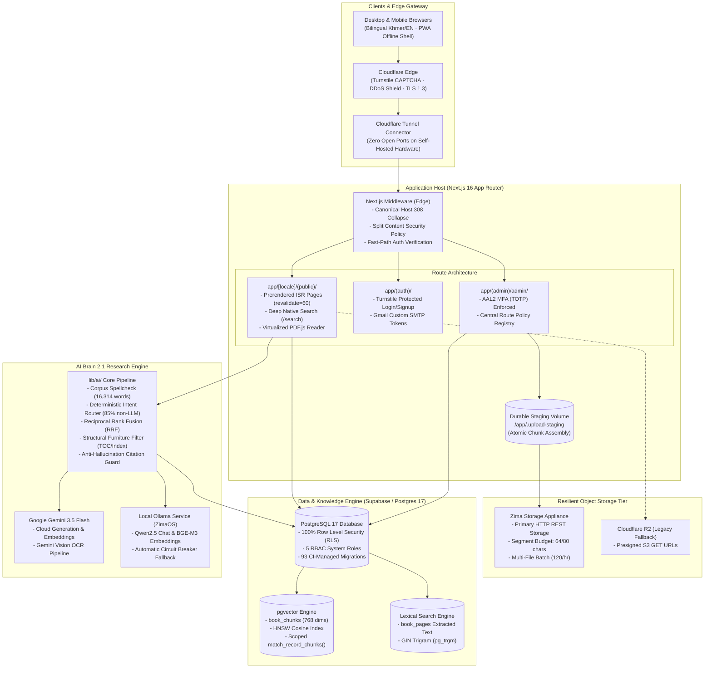

# PTEC e-Library (បណ្ណាល័យឌីជីថល វិទ្យាស្ថានគរុកោសល្យរាជធានីភ្នំពេញ)

<div align="center">

[](https://library.ptec.edu.kh)
[](https://nextjs.org)
[](https://react.dev)
[](https://www.typescriptlang.org)
[](https://tailwindcss.com)
[](https://supabase.com)
[](https://serwist.pages.dev)
[](LICENSE)

<p align="center">
  <strong>An enterprise-grade, bilingual (Khmer & English) digital academic repository and AI-assisted research library purpose-built for the Phnom Penh Teacher Education College (PTEC).</strong>
</p>

<p align="center">
  <a href="https://library.ptec.edu.kh"><strong>Explore Live Library »</strong></a>
  &nbsp;&nbsp;•&nbsp;&nbsp;
  <a href="https://library.ptec.edu.kh/km"><strong>កំណែភាសាខ្មែរ »</strong></a>
  &nbsp;&nbsp;•&nbsp;&nbsp;
  <a href="https://portfolio-beige-rho-51.vercel.app/en"><strong>Creator Portfolio »</strong></a>
</p>

</div>

---

## 🏛️ Project Overview

**PTEC e-Library** is a free, public digital library and academic repository engineered to serve teacher educators, pre-service teacher trainees, and educational researchers across Cambodia. It bridges the accessibility gap for higher education by cataloging textbooks, curriculum guides, teacher training manuals, monographs, and student action-research theses into a unified, lightning-fast digital portal.

The platform operates across dual deployment targets:
1. **Primary Cloud Edge**: Hosted on **Vercel** pinned to Singapore (`sin1`), achieving single-digit millisecond latency to our Supabase database.
2. **Self-Hosted Appliance**: Deployed in a hardened Docker container on **ZimaOS** behind **Cloudflare Tunnels**, featuring local hardware-accelerated LLMs (**Ollama**) and **Zima Storage**.

---

## 📐 System Architecture



---

## ✨ Core Features & Technical Highlights

### 1. 📖 Cutting-Edge Digital Reading Experience
* **Byte-Range Streaming (`disableAutoFetch: true`, `disableStream: true`)**: Instead of downloading entire 100+ MB PDFs, the reader requests only visible pages via HTTP 206 Byte-Range requests (reducing initial payload from ~178 MB to ~7 MB).
* **Native Dark Mode Recoloring**: Uses PDF.js's native `pageColors` API (`#151B26` background, `#E6EAF0` foreground) rather than naive CSS `invert()` filters, preserving diagram clarity and typography contrast.
* **Canvas Memory Virtualization**: Dynamically mounts and unmounts distant pages with `page.cleanup()`, enforcing strict canvas budgets by device tier (Mobile, Tablet, Desktop) to prevent browser tab crashes.
* **Resilient Connectivity State Machine**: Detects stalls and network drops; verifies recovery with 1-byte range probes before executing a state-preserving reload.
* **Lab PC Account Isolation**: Reading progress (`reading_progress.last_page`) and bookmarks are stamped with the authenticated user's ID, preventing session collisions on shared campus workstations.
* **In-Book Client-Side Search**: Zero-network-latency search highlighting exact character matches with navigable occurrence counters.
* **Selection & Research Toolbar**: Highlight passages in 4 colors, add private notes, and generate formatted academic citations with one click.

### 2. ⚡ PWA & Offline Digital Library
* **Serwist Service Worker Engine (`app/sw.ts`)**: Fine-grained caching policies separating hashed app assets, PDF.js workers, and dynamic API responses.
* **Zero-Leak Offline Storage (`lib/offline.ts`)**: Binary PDF bytes are stored exclusively in the browser's Cache Storage under an isolated `offline-books` cache, verified via read-back assertions before marking titles as available offline.
* **Cold-Bootable Shells**: Dedicated `/offline-books` shelf and `/offline-reader` client viewer that function without an active internet connection.
* **Multi-Tenant Automatic Cleanse**: Automatically purges locally cached books and private bookmarks if a different user logs in on a shared PC.

### 3. 🧠 AI Brain 2.1 Research Assistant
* **Deterministic Intent Classification (85% Non-LLM Resolution)**: Library queries, catalog searches, and opening hours are resolved directly from database tables using bilingual templates—costing zero LLM tokens with zero hallucination risk.
* **Hybrid Retrieval with Reciprocal Rank Fusion (RRF)**: Executes parallel lexical scans (`book_pages` via `pg_trgm`) and semantic vector scans (`book_chunks` via `pgvector(768)` HNSW), fusing candidates through RRF.
* **Structural Furniture Filter (`lib/ai/page-quality.ts`)**: Heuristically detects and eliminates non-evidence sections (Tables of Contents, Indices) using sentence density and locator density signals, preventing TOC hits from dominating results.
* **Multi-Tier Provider Routing**: Automatically serves queries via local **Ollama** (`qwen2.5`) on edge hardware, falling back to **Gemini 3.5 Flash** if the local instance experiences high latency or downtime.
* **Strict Anti-Hallucination Citation Grounding**: The post-generation engine scans LLM output for citations `(Title, p. N)`, verifies them against retrieved passage metadata, and aggressively scrubs ungrounded claims.

### 4. 🛡️ Enterprise RBAC & Security Boundary
* **Centralized Authorization Policy (`lib/admin/access-policy.ts`)**: Declarative permissions registry. Every admin route and server mutation checks policies via `await requireRouteAccess("books.upload")`.
* **5-Tier Role-Based Access Control**: `reader`, `staff`, `librarian`, `admin`, and `super_admin`.
* **AAL2 Multi-Factor Authentication (TOTP)**: Enforced across all administrative pages under `/admin/(protected)`.
* **Next.js 16 Auth Interrupts**: Access denials throw real HTTP 403 (`forbidden.tsx`) and HTTP 401 (`unauthorized.tsx`) status codes rather than generic masked React errors.
* **Real-Time Security Posture & Telegram Dispatch**: Out-of-band security scanner runs every 5 minutes (`/api/cron/security-scan`), identifying credential stuffing, brute-force attempts, and malware uploads, instantly alerting via Telegram.

### 5. 📦 Resilient Chunked Upload & Bulk Import Engine
* **4-Verb Chunked Upload Protocol (`init`, `chunk`, `finalize`, `GET`, `DELETE`)**: Upload files up to 100 MiB with zero risk of HTTP timeouts.
* **Durable Volume Staging**: Parts are written to a persistent Docker named volume (`UPLOAD_STAGING_DIR`), preventing "Missing chunk 0" errors during container redeployments.
* **Compare-And-Set (CAS) Concurrency**: Prevents race conditions during chunk assembly.
* **Low-Memory Streaming Envelope (`zimaUploadStream`)**: Uploads directly to Zima Storage within a 1 MB memory window with an exact byte-calculated multipart boundary.
* **High-Throughput Bulk Import**: Combines PDF and cover images into a single `POST /api/v1/files` request, unlocking 120 books/hour (a 4× increase over single-file paths) while staying within storage API quotas.
* **Preflight Deduplication Gate**: Triple-check verification using SHA-256 hash, normalized ISBN-13, and Khmer-aware title tokenization.

---

## 🛠️ Technology Stack

| Layer | Technology | Purpose |
|---|---|---|
| **Framework** | [Next.js 16.3.4](https://nextjs.org) (App Router) | React Server Components, standalone output, `--webpack` build for PWA worker |
| **UI Library** | [React 19.2.6](https://react.dev) | Server Actions, optimistic state, Suspense streaming |
| **Styling** | [Tailwind CSS v4](https://tailwindcss.com) | Modern CSS-first engine, OKLCH color design tokens |
| **Database** | [Supabase](https://supabase.com) / PostgreSQL 17 | 100% RLS enforcement, PostgREST, GoTrue auth, connection pooling |
| **Vector Engine** | [pgvector](https://github.com/pgvector/pgvector) | 768-dimensional HNSW cosine index for semantic literature chunks |
| **Lexical Engine** | PostgreSQL `pg_trgm` | Trigram subword indexing across unsegmented Khmer script |
| **Object Storage** | [Zima Storage](https://github.com/IceWhaleTech) & Cloudflare R2 | HTTP REST storage with atomic chunk assembly; legacy presigned R2 fallback |
| **AI / LLM** | [Google Gemini 3.5](https://deepmind.google/technologies/gemini/) & [Ollama](https://ollama.ai) | Hybrid RAG, Gemini Vision OCR, text-embedding-001, local Qwen2.5 |
| **PDF Engine** | [PDF.js 6.2](https://mozilla.github.io/pdf.js/) & [React-PDF 10.4](https://github.com/wojtekmaj/react-pdf) | Range-request streaming viewer with canvas budgeting and dark recoloring |
| **PWA & Offline** | [Serwist 9.5](https://serwist.pages.dev) & Web Push | Service worker caching, offline document shell, VAPID push notifications |
| **i18n** | [next-intl 4.13](https://next-intl-docs.vercel.app/) | Prerendered locale routing (`/` for English, `/km` for Khmer) |
| **Testing** | [Vitest 4.1](https://vitest.dev) & [Playwright 1.60](https://playwright.dev) | Unit testing, local Supabase container replay, end-to-end browser tests |

---

## 🚀 Getting Started (Local Development)

### Prerequisites
- **Node.js 20+** or **Node.js 22 LTS**
- **Docker Desktop** (for running local Supabase and storage services)
- **Supabase CLI** (`npm install -g supabase`)

### 1. Clone & Install Dependencies
```bash
git clone https://github.com/raksmeyron97-design/ptec-elibrary.git
cd ptec-elibrary

# Install dependencies and trigger postinstall (copies PDF.js assets)
npm install
```

### 2. Configure Environment Variables
Copy `.env.example` to `.env.local`:
```bash
cp .env.example .env.local
```
Fill in the required variables (see [Environment Variable Registry](#-environment-variable-registry)).

### 3. Start Local Supabase Stack
```bash
supabase start
```
This boots PostgreSQL, PostgREST, GoTrue Auth, Storage, and automatically replays all 93 migrations from `supabase/migrations/` plus `supabase/seed.sql`.

### 4. Run Development Server
```bash
npm run dev
```
Open [http://localhost:3000](http://localhost:3000) in your browser.

> [!TIP]
> If dev server renders become slow, clear Next.js Turbopack caches with:
> ```bash
> npm run dev:clean
> ```

---

## 🧪 Testing & Quality Gates

The project enforces strict automated quality gates before any code merges to `main`:

```bash
# Type check (allocates 4 GB heap to prevent OOM)
npx tsc --noEmit

# Lint code quality
npm run lint

# Run Vitest unit & invariant tests
npm test            # Watch mode
npx vitest run      # Single-pass CI execution

# Run Playwright End-to-End tests (boots local Supabase stack)
npm run test:e2e

# Run AI & Retrieval benchmarks
npm run ai:answer-benchmark -- --live-suite smoke --gate
npm run retrieval:benchmark
npm run search:benchmark

# Verify local Ollama AI connectivity (Khmer support & fallback)
npm run ai:local-check

# Verify PWA and hero image assets
npm run check:hero
npm run pwa:assets
```

---

## 🔒 Security & Invariant Enforcement

Our automated test suite continuously asserts structural engineering invariants:

| Invariant Test Suite | Enforced Architectural Rule |
|---|---|
| `lib/cache/cache-safety.test.ts` | Disallows `cookies()` or `headers()` in public route trees to maintain full static ISR prerenderability. |
| `lib/storage/folder-name.test.ts` | Validates all storage folder path segments against Zima's 80-char regex and enforces 100% ASCII compliance. |
| `lib/uploads/state.test.ts` | Guarantees upload state machine safety: sessions cannot reach `COMPLETED` without reaching `STORED`. |
| `lib/admin/authorization-boundary.test.ts` | Asserts that every Server Action enforces permission guards before opening service-role database clients. |
| `lib/ai/live-contract.test.ts` | Enforces that reasoning token budgets never consume output quotas and verified citations match ground truth. |
| `lib/ai/page-quality.test.ts` | Proves that structural book furniture (TOC, Index) is excluded from AI evidence while substantive text is retained. |
| `lib/pdf-worker-tracing.test.ts` | Guarantees that `pdf.worker.mjs` is correctly bundled into standalone output builds, preventing PDF indexing crashes. |

---

## ⚙️ Environment Variable Registry

| Variable Name | Scope | Required | Description |
|---|:---:|:---:|---|
| `NEXT_PUBLIC_SUPABASE_URL` | Client | Yes | Supabase API Gateway URL (Cloud or Self-Hosted Kong). |
| `NEXT_PUBLIC_SUPABASE_ANON_KEY` | Client | Yes | Public anonymous JWT key used for browser queries. |
| `SUPABASE_SERVICE_ROLE_KEY` | Server | Yes | Elevated key bypassing RLS. **Never expose to the client!** |
| `ZIMA_API_URL` | Server | Yes | Base URL of the primary Zima Storage appliance. |
| `ZIMA_API_KEY` | Server | Yes | Secret API key for Zima file mutations. |
| `GEMINI_API_KEY` | Server | Yes | Google Cloud API key for Gemini 3.5 Flash and text embeddings. |
| `AI_PROVIDER` | Server | Optional | Default generation engine (`gemini` or `ollama`). Defaults to `gemini`. |
| `AI_EMBED_PROVIDER` | Server | Optional | Embedding engine (`gemini`). Must match vector database dimensions (768). |
| `OLLAMA_BASE_URL` | Server | Optional | Local Ollama endpoint on self-hosted hardware (`http://127.0.0.1:11434`). |
| `UPLOAD_STAGING_DIR` | Server | Yes | Persistent directory for chunked upload staging (`/app/.upload-staging`). |
| `NEXT_PUBLIC_SITE_URL` | Client | Yes | Canonical production origin (`https://library.ptec.edu.kh`). |
| `NEXT_PUBLIC_TURNSTILE_SITE_KEY` | Client | Yes | Cloudflare Turnstile public site key. |
| `TURNSTILE_SECRET_KEY` | Server | Yes | Cloudflare Turnstile server verification secret. |
| `CRON_SECRET` | Server | Yes | Bearer token protecting automated `/api/cron/*` endpoints. |
| `TELEGRAM_BOT_TOKEN` | Server | Yes | Telegram bot token for real-time Sev 1/2/3 security and system alerts. |
| `TELEGRAM_CHAT_ID` | Server | Yes | Target Telegram channel/group ID for notifications. |
| `SMTP_USER` / `SMTP_PASS` | Server | Yes | Gmail custom SMTP credentials for transactional authentication emails. |

---

## 🚢 Deployment Guide

### Deployment Target 1: Vercel (Primary Cloud Edge)
1. Link your repository to Vercel.
2. In Project Settings, ensure the region is set to **Singapore (`sin1`)** in `vercel.json`.
3. Provide all environment variables listed above.
4. Set Node.js version to **22.x**.

### Deployment Target 2: ZimaOS / Self-Hosted Docker Compose
The repository ships with a multi-stage, hardened Docker setup:

```bash
# 1. Build and run using the production docker-compose
docker compose up -d --build

# 2. View container logs
docker compose logs -f ptec-elibrary
```

- Operates as non-root user `nextjs` (UID 1001) on Alpine Linux.
- Mounts persistent volume `upload-staging` to preserve chunked uploads across updates.
- Connects through an internal `web` Docker bridge to a `cloudflared` sidecar container—requiring **zero open inbound ports** on your local network firewall.

---

## 👨‍💻 Author & Maintainer

**Ron Raksmey (រ៉ុន រស្មី)**  
*Educator, Mathematics Scholar & Full-Stack Product Builder*  
Phnom Penh, Cambodia 🇰🇭

- **Personal Portfolio**: [portfolio-beige-rho-51.vercel.app](https://portfolio-beige-rho-51.vercel.app/en)
- **LinkedIn**: [Ron Raksmey](https://www.linkedin.com/in/ron-raksmey-5a615640a)
- **Telegram**: [@Ron_Raksmey](https://t.me/Ron_Raksmey)
- **Email**: `raksmeyron97@gmail.com`
- **Institutional Affiliation**: Phnom Penh Teacher Education College (PTEC)

---

<div align="center">
  <sub>Built with ❤️ for Cambodian Teacher Education and Open Academic Access.</sub>
</div>
