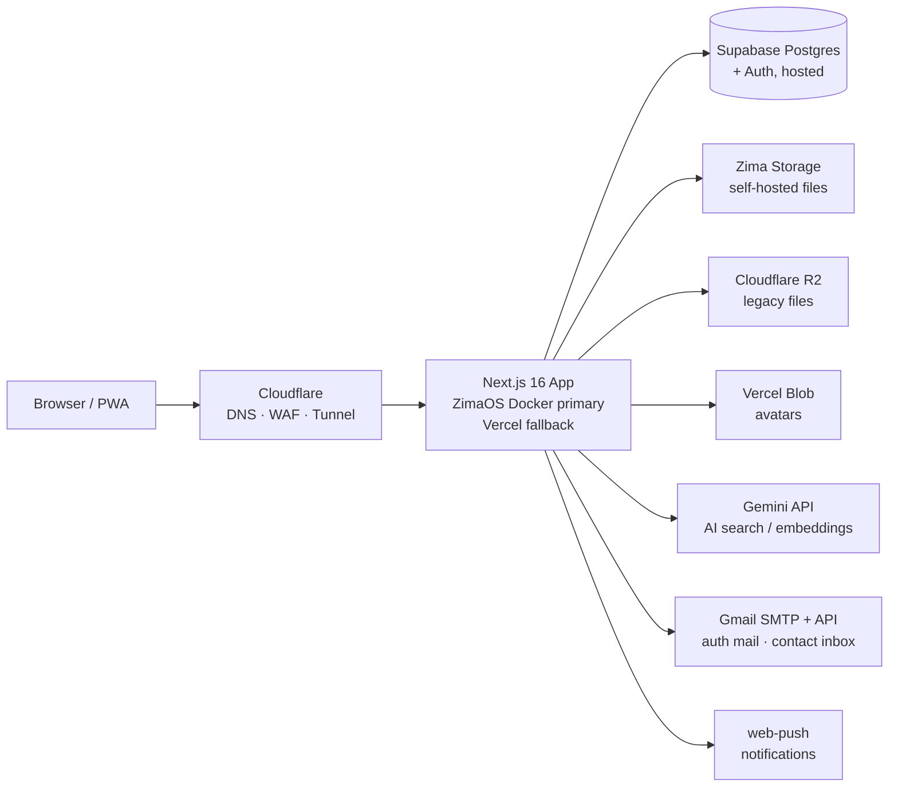
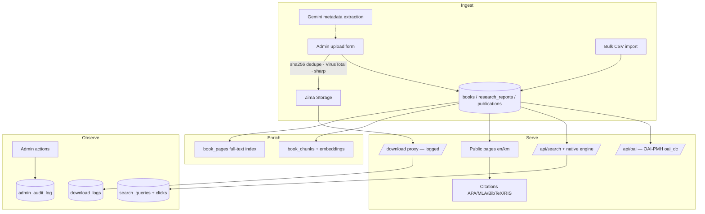
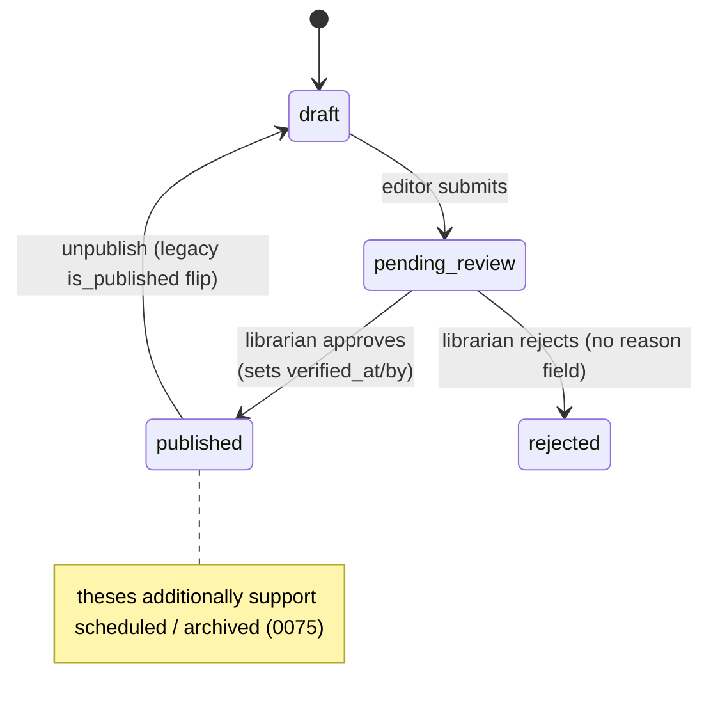
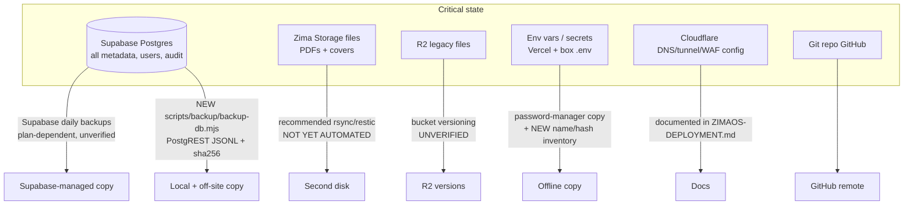
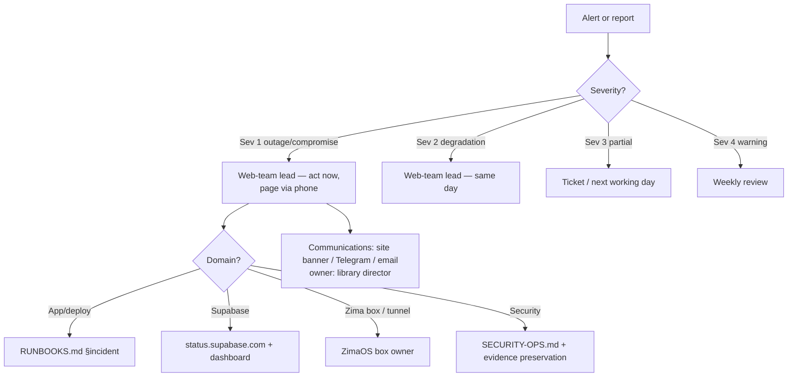

# Operations Audit — Current-State Assessment (Phase 1)

_Created 2026-07-11 as the audit deliverable for the 30–60-day reliability &
governance roadmap. Companion docs created in the same phase:
`BACKUP-DR.md`, `ALERT-CATALOG.md`, `RUNBOOKS.md`, `DATA-GOVERNANCE.md`,
`METADATA-EXPORTS.md`, `TABLETOP-EXERCISES.md`._

## 1. Current-state architecture

- **App**: Next.js 16 App Router; route groups `(public)` (locale-routed
  en/km), `(auth)`, `(admin)`. Middleware: per-request CSP nonce, locale
  rewrite, `x-request-id` correlation.
- **DB**: hosted Supabase Postgres, ~70 public tables (RLS matrix:
  `RLS-MATRIX.md`), pgvector embeddings, DB-backed rate limiting.
- **Files**: Zima primary (`books/ research/ posts/ reports/ team/ avatars/`),
  R2 legacy fallback, Vercel Blob avatars.
- **Auth**: Supabase Auth; 5 roles (`reader → staff → librarian → admin →
  super_admin`) + `role_permissions` matrix; MFA (AAL2) enforced for the
  admin panel.

## 2. Data flow (content lifecycle)

## 3. Content-publication workflow (as found)

Found gaps (fixed by this phase — see migration `0086`):
- No `created_by` / `updated_by` on books & theses (publications had `created_by`).
- No stored **reason** for rejection; no reviewer assignment; no in-review state.
- No change history / previous-values snapshot → no rollback.
- Nothing prevented an editor from approving their own record.
- No metadata-quality checklist; approval was a single yes/no.
- Books lacked `scheduled` / `archived` states (theses gained them in 0075).
- OAI feed gated on `is_published` + license, **not** on verification.

## 4. Backup dependency map

Derived/re-buildable data (excluded from RPO): `book_pages` (rebuild:
`scripts/extract-pdf-text.ts` path), `book_chunks` + `books.embedding`
(rebuild: `scripts/embed-library.ts`), rate_limit, caches.

## 5. Incident escalation map

Roles (small-team reality): **web-team lead** (technical owner, first
responder), **library director** (communications, policy approval),
**ZimaOS box owner** (physical infra). Contact list lives outside the repo
(shared drive), referenced — never inlined — per the no-PII rule.

## 6. What already existed vs. what this phase adds

| Area | Already in place | Gap closed in this phase |
|---|---|---|
| Editorial workflow | `status` (0061/0075), `verified_at/by` + license (0062), `/admin/review` queue, `admin_audit_log` | Full status vocabulary, provenance columns, review notes, reviewer assignment, self-approval guard, version history + rollback, quality checklist, upgraded queue UI (migration 0086) |
| Backups | SECURITY-OPS.md §3 recommendations (manual, unverified) | Scripted DB backup + integrity verify + **isolated PGlite restore drill**, config fingerprint, `ops_events` freshness monitoring, BACKUP-DR.md with RPO/RTO (migration 0088) |
| Zero-result analytics | `search_queries` (+result_count/lang/type), `/admin/search-insights` dashboard | Admin actions (review/ignore/acquire/synonym/curated), synonym expansion in search, bot exclusion, anonymous session hash, retention purge (migration 0087) |
| Metadata exports | OAI-PMH oai_dc (XSD-validated), APA/MLA/Chicago/IEEE/BibTeX/RIS + download UI, JSON-LD | `/api/export` feeds (Dublin Core JSON/XML, CSL-JSON, BibTeX, RIS) with pagination/rate-limit/caching/versioning, verified-only gating incl. OAI, METADATA-EXPORTS.md, validation tests |
| Monitoring | `/api/health`, security-log events, MONITORING.md probes + 8 runbooks | Deep health probe (latency, backup freshness), full ALERT-CATALOG.md (Sev 1–4, owner/suppression/escalation per alert) |
| Runbooks | 8 incident runbooks in MONITORING.md | RUNBOOKS.md: maintenance checklists (daily→quarterly) + 18 incident runbooks in 13-section format, DATA-GOVERNANCE.md, tabletop exercise records |

## 7. Risk register

| # | Risk | Likelihood | Impact | Current control | Mitigation (this phase) | Owner |
|---|---|---|---|---|---|---|
| R1 | Zima Storage box loss → all primary PDFs/covers gone | Medium | Critical | None automated (single copy) | rsync/restic job on box (BACKUP-DR.md §3), file inventory in DB backup, drill validates re-linking | Box owner |
| R2 | Supabase project loss/pause (free-tier pause, billing, region incident) | Medium | Critical | Supabase managed backups (plan-dependent, **unverified**) | Independent scripted JSONL backups + verified restore drill; verify dashboard backups monthly | Web lead |
| R3 | Bad metadata published (wrong author/title/license) harms institutional credibility | High | Medium | Single-step approve; no history | Verification workflow, quality checklist, version rollback, verified-only exports | Librarian |
| R4 | Admin account compromise (password reuse) | Low | Critical | MFA AAL2, security log, audit log | Runbook §admin-compromise + quarterly access review; alert on auth anomalies | Web lead |
| R5 | Silent backup failure discovered only at restore time | High | High | None | `ops_events` heartbeat + health `backup_age` + failed-backup alert | Web lead |
| R6 | Secret leak (env in commit/doc/log) | Low | High | gitleaks CI, no-secrets logging contract | Secret-rotation runbook; config fingerprint stores names+hashes only | Web lead |
| R7 | Search analytics accumulate user-typed terms indefinitely (privacy) | Medium | Medium | RLS service-only (0084) | Retention purge (default 365 d) via cron + governance policy | Web lead |
| R8 | Broken migration on hosted DB (no staging) | Medium | High | Sequential files, manual apply | Migration procedure runbook (backup-first, rollback notes per migration); drill restores prove backups usable | Web lead |
| R9 | Gmail App-Password revocation → silent auth/contact mail failure | Medium | Medium | Weekly log check (manual) | Contact-email runbook + weekly checklist item; alert on `/api/contact` 5xx | Web lead |
| R10 | Single-person team (bus factor 1) | High | High | Docs in repo | RUNBOOKS.md written to be followable by a non-author; staff onboarding checklist | Director |
| R11 | Disk exhaustion (box: uploads/docker; Supabase: book_pages/chunks) | Medium | High | Manual df checks | Disk runbook + 80/90 % alerts; derived-tables purge guidance | Box owner |
| R12 | DDoS / scraping burst on downloads | Medium | Medium | DB rate limits, DDOS-PROTECTION.md, env kill-switches | Alert catalog entries + tabletop exercise TT-6 | Web lead |

## 8. Constraints honored by this phase

- Hosted DB migrations are applied **manually by the maintainer** — all new
  code degrades gracefully until 0086–0088 are applied (established
  fallback pattern; see `trust-fields` precedent).
- Restore drills never touch production: PGlite (embedded Postgres) target.
- No secrets in docs/scripts; backup config inventory stores **names +
  SHA-256 of values** only.
- Existing public/admin behavior preserved: `is_published` sync triggers
  keep every legacy query working; new statuses map onto the old boolean.
