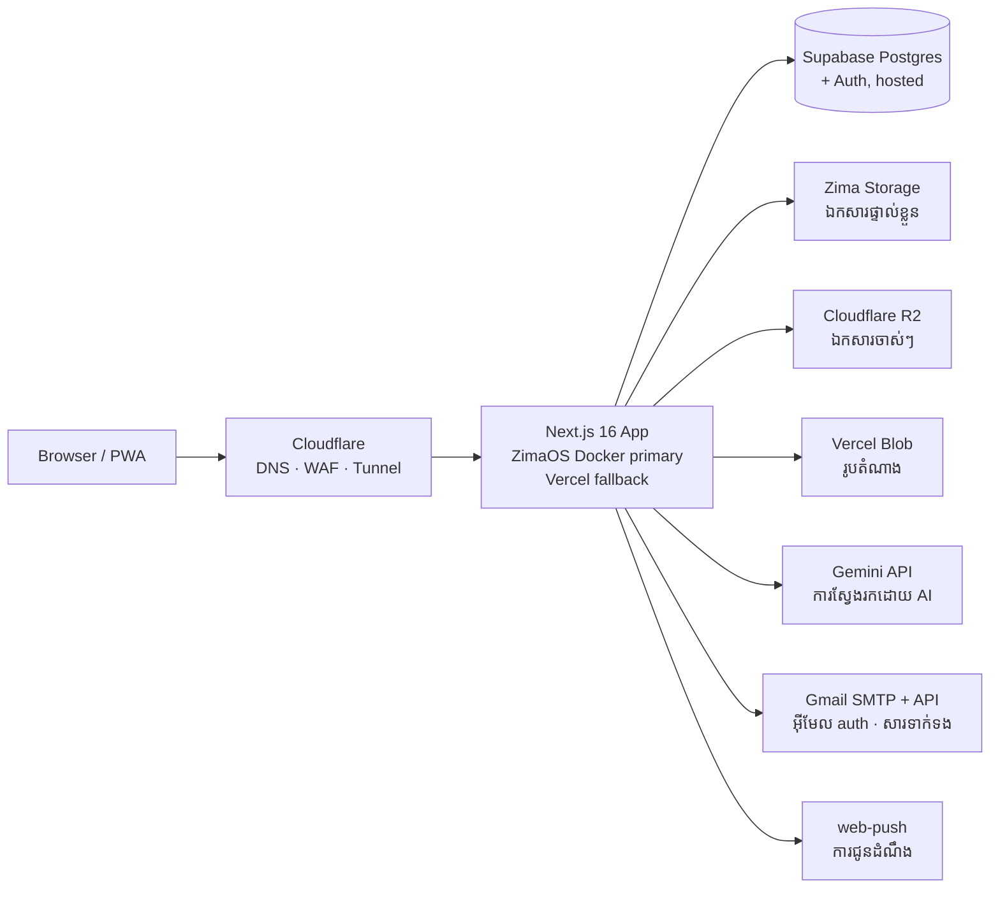
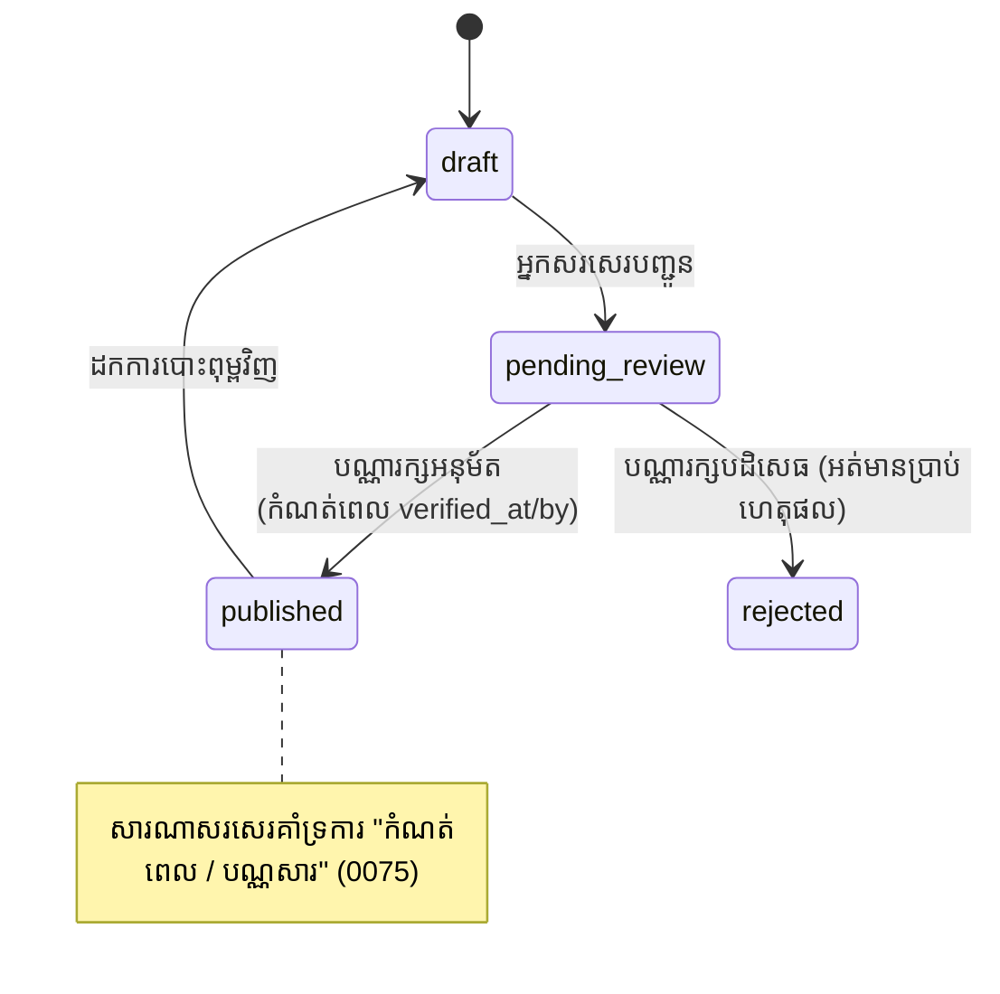
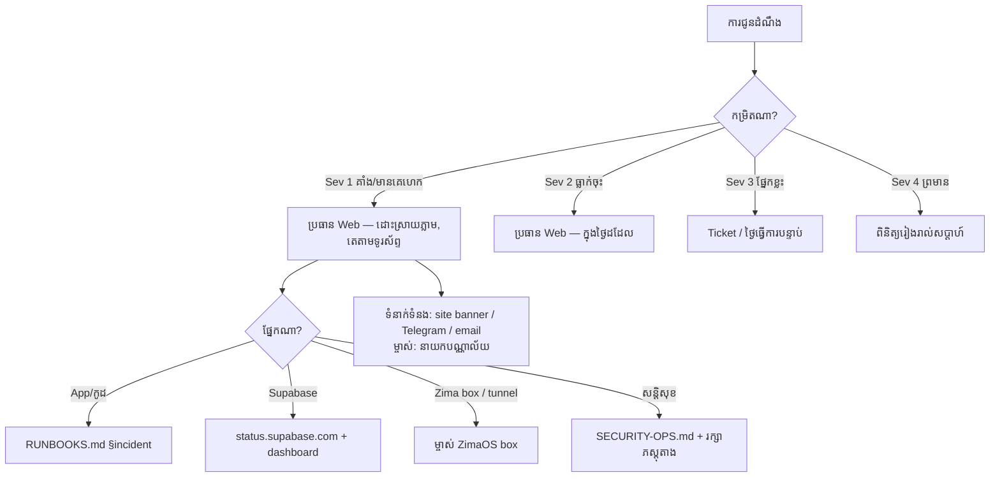

# សវនកម្មប្រតិបត្តិការ (Operations Audit — ការវាយតម្លៃស្ថានភាពបច្ចុប្បន្ន ដំណាក់កាលទី 1)

_បានបង្កើតនៅថ្ងៃទី ១២ ខែកក្កដា ឆ្នាំ២០២៦ ជាលទ្ធផលសវនកម្មសម្រាប់ផែនការ ៣០–៦០ ថ្ងៃ។ ឯកសាររួមគ្នាក្នុងដំណាក់កាលនេះមាន៖ `BACKUP-DR.md`, `ALERT-CATALOG.md`, `RUNBOOKS.md`, `DATA-GOVERNANCE.md`, `METADATA-EXPORTS.md`, `TABLETOP-EXERCISES.md`។_

## 1. ស្ថាបត្យកម្មបច្ចុប្បន្ន (Current-state architecture)



- **App**: ប្រើ Next.js 16 App Router; មានផ្នែក `(public)` (ជា២ភាសា en/km), `(auth)`, `(admin)`។ Middleware ប្រើសម្រាប់: CSP nonce, ប្តូរភាសា, និងចាប់លេខកូដសំណើ (request-id)។
- **DB**: ប្រើ Supabase Postgres ផ្ទុកលើ Cloud, មានប្រហែល 70 តារាង (បញ្ជី RLS: `RLS-MATRIX.md`), pgvector សម្រាប់ AI, ការរឹតត្បិតសំណើ (rate limit) តាម DB។
- **Files**: Zima ជាកន្លែងផ្ទុកចម្បង (`books/ research/ posts/ reports/ team/ avatars/`), R2 សម្រាប់ឯកសារចាស់ៗ, Vercel Blob សម្រាប់រូបតំណាង (avatars)។
- **Auth**: ប្រើ Supabase Auth; មាន ៥ តួនាទី (`reader → staff → librarian → admin → super_admin`) + តារាងសិទ្ធិ `role_permissions`; តម្រូវឱ្យប្រើ MFA (AAL2) សម្រាប់គណនី Admin។

## 2. លំហូរទិន្នន័យ (Data flow - content lifecycle)

```mermaid
flowchart TD
    subgraph ការបញ្ចូល (Ingest)
      A1[ទម្រង់ Admin] -->|sha256 កាត់ស្ទួន · VirusTotal · sharp| Z[Zima Storage]
      A2[បញ្ចូល CSV ច្រើន] --> DB
      A1 --> DB[(សៀវភៅ / របាយការណ៍ / ការបោះពុម្ព)]
      AI[Gemini ទាញយក Metadata] -.-> A1
    end
    subgraph ការបង្កើនគុណភាព (Enrich)
      DB --> PIDX[book_pages សម្រាប់ Full-text]
      DB --> EMB[book_chunks + AI embeddings]
    end
    subgraph ការផ្តល់សេវា (Serve)
      DB --> PUB[ទំព័រសាធារណៈ en/km]
      DB --> SRCH[/api/search + native engine/]
      DB --> OAI[/api/oai — OAI-PMH oai_dc/]
      PUB --> CIT[ការដកស្រង់ APA/MLA/BibTeX/RIS]
      Z --> DL[/ទាញយកតាម proxy — មានកត់ត្រា/]
    end
    subgraph ការតាមដាន (Observe)
      SRCH --> SQ[(search_queries + clicks)]
      DL --> DLOG[(download_logs)]
      ADM[សកម្មភាព Admin] --> AUD[(admin_audit_log)]
    end
```

## 3. ដំណើរការការងារបោះពុម្ពមាតិកា (Content-publication workflow - បច្ចុប្បន្ន)



ចំណុចខ្វះខាតដែលរកឃើញ (ជួសជុលក្នុងដំណាក់កាលនេះ — មើលការកែប្រែ `0086`)៖
- គ្មានជួរឈរ `created_by` / `updated_by` លើសៀវភៅនិងសារណា (មានតែលើការបោះពុម្ព)។
- គ្មានការកត់ត្រា **មូលហេតុ** ពេលបដិសេធ; គ្មានការចាត់តាំងអ្នកត្រួតពិនិត្យ; គ្មានស្ថានភាព "កំពុងត្រួតពិនិត្យ (in-review)"។
- គ្មានប្រវត្តិការផ្លាស់ប្តូរ (Change history) → ថយក្រោយមិនបាន (No rollback)។
- គ្មានការទប់ស្កាត់មិនឱ្យអ្នកសរសេរឯកសារ ធ្វើការអនុម័តឯកសារខ្លួនឯង។
- គ្មានតារាងចំណុចត្រួតពិនិត្យគុណភាព (Quality checklist); ការអនុម័តគ្រាន់តែជាការយល់ព្រមធម្មតា។
- សៀវភៅមិនមានស្ថានភាព `scheduled` (កំណត់ពេល) ឬ `archived` (បណ្ណសារ) (ចំណែកសារណាមាននៅកូដ 0075)។
- ការចែករំលែក OAI អនុញ្ញាតឲ្យតែឯកសារ `is_published` ប៉ុណ្ណោះ, **មិនមែន** ដោយសារការផ្ទៀងផ្ទាត់ (verification) ទេ។

## 4. ផែនទីពឹងផ្អែកនៃការបម្រុងទុក (Backup dependency map)

```mermaid
flowchart TD
    subgraph ស្ថានភាពសំខាន់ (Critical state)
      DB[(Supabase Postgres<br/>គ្រប់ Metadata, users, audit)]
      FILES[ឯកសារលើ Zima<br/>PDFs + រូបក្រប]
      R2L[ឯកសារចាស់ៗលើ R2]
      ENV[អថេរ / លេខកូដសម្ងាត់<br/>Vercel + box .env]
      INFRA[Cloudflare DNS/tunnel/WAF config]
      CODE[Git repo GitHub]
    end
    DB -->|Backup របស់ Supabase<br/>អាស្រ័យលើ Plan, អត់ទាន់បញ្ជាក់| B1[ច្បាប់ចម្លង Supabase]
    DB -->|ថ្មី: scripts/backup/backup-db.mjs<br/>PostgREST JSONL + sha256| B2[ក្នុងម៉ាស៊ីន + លាក់ក្រៅប្រព័ន្ធ]
    FILES -->|ណែនាំ rsync/restic<br/>មិនទាន់ស្វ័យប្រវត្តិទេ| B3[Disk ទីពីរ]
    R2L -->|bucket versioning<br/>មិនទាន់បញ្ជាក់| B4[R2 versions]
    ENV -->|ក្នុង password-manager<br/>+ ថ្មី: កត់ត្រាឈ្មោះ/hash| B5[ច្បាប់ចម្លង Offline]
    INFRA -->|មានក្នុង ZIMAOS-DEPLOYMENT.md| B6[Docs]
    CODE --> B7[GitHub remote]
```

ទិន្នន័យដែលអាចបង្កើតឡើងវិញបាន (មិនរាប់បញ្ចូលក្នុង RPO)៖ `book_pages` (រត់: `scripts/extract-pdf-text.ts`), `book_chunks` + `books.embedding` (រត់: `scripts/embed-library.ts`), rate_limit និង caches ផ្សេងៗ។

## 5. ផែនទីរាយការណ៍ពេលមានបញ្ហា (Incident escalation map)



តួនាទី (ក្រុមតូច)៖ **ប្រធានក្រុមការងារវេប (web-team lead)** (ម្ចាស់បច្ចេកទេស, អ្នកដោះស្រាយមុនគេ), **នាយកបណ្ណាល័យ (library director)** (ទំនាក់ទំនង, អនុម័តគោលការណ៍), **ម្ចាស់ម៉ាស៊ីន Zima (ZimaOS box owner)** (ហេដ្ឋារចនាសម្ព័ន្ធរូបវ័ន្ត)។ បញ្ជីទំនាក់ទំនងមាននៅខាងក្រៅកូដ (ក្នុង shared drive)។

## 6. អ្វីដែលមានស្រាប់ ធៀបនឹង អ្វីដែលបន្ថែមថ្មី

| ផ្នែក | អ្វីដែលមានស្រាប់ | អ្វីដែលបានកែលម្អបន្ថែមថ្មី |
|---|---|---|
| ប្រព័ន្ធអនុម័ត (Editorial workflow) | `status` (0061/0075), `verified_at/by` + អាជ្ញាប័ណ្ណ (0062), ជួរ `/admin/review`, `admin_audit_log` | ស្ថានភាពមានច្រើនជាងមុន, មានអ្នកបង្កើត/អ្នកកែប្រែ, មានកំណត់សម្គាល់, ចាត់តាំងអ្នកត្រួតពិនិត្យ, ហាមមិនឲ្យអនុម័តខ្លួនឯង, មានប្រវត្តិអាចទាញមកវិញបាន, មានបញ្ជីត្រួតពិនិត្យគុណភាព, ធ្វើឲ្យ UI កាន់តែល្អ (0086) |
| ការបម្រុងទុក (Backups) | ណែនាំក្នុង SECURITY-OPS.md §3 (ធ្វើដោយដៃ, មិនទាន់ច្បាស់) | មាន Script Backup DB + ផ្ទៀងផ្ទាត់ + **ធ្វើតេស្តសាកល្បង Restore ជាមួយ PGlite**, កត់ត្រាកូដសម្ងាត់ (fingerprint), តាមដានភាពស្រស់ៗនៃ `ops_events`, មាន BACKUP-DR.md ជាមួយគោលដៅ RPO/RTO (0088) |
| វិភាគរកអត់ឃើញ (Zero-result analytics) | `search_queries` (+result_count/lang/type), `/admin/search-insights` dashboard | សកម្មភាព Admin (review/ignore/acquire/synonym/curated), មុខងារសទិសន័យ (synonym) ក្នុង Search, ប្លុក Bots, ចំណាំ User មិនបង្ហាញ IP (session hash), លុបចោលទិន្នន័យចាស់ៗ (0087) |
| ការទាញចេញ (Metadata exports) | OAI-PMH oai_dc (XSD-validated), APA/MLA/Chicago/IEEE/BibTeX/RIS + download UI, JSON-LD | `/api/export` (Dublin Core JSON/XML, CSL-JSON, BibTeX, RIS) ដែលមានបែងចែកទំព័រ/រឹតត្បិត/caching/ជំនាន់, អនុញ្ញាតឲ្យតែឯកសារបាន verified ប៉ុណ្ណោះ, មាន METADATA-EXPORTS.md, ធ្វើតេស្តត្រឹមត្រូវ |
| ការតាមដាន (Monitoring) | `/api/health`, កំណត់ត្រាសន្តិសុខ, MONITORING.md រួមជាមួយ ៨ runbooks ចាស់ | មាន Probe ស៊ីជម្រៅ (ពិនិត្យ Backup), មាន ALERT-CATALOG.md ពេញលេញ (Sev 1–4, កំណត់អ្នកទទួលខុសត្រូវ/របៀបដោះស្រាយ) |
| សៀវភៅណែនាំ (Runbooks) | ៨ incident runbooks ក្នុង MONITORING.md | RUNBOOKS.md: តារាងការងារ (ប្រចាំថ្ងៃ→ត្រីមាស) + ១៨ incident runbooks, មាន DATA-GOVERNANCE.md, កំណត់ត្រាធ្វើតេស្តសាកល្បង |

## 7. បញ្ជីហានិភ័យ (Risk register)

| ល.រ | ហានិភ័យ | ឱកាស | ផលប៉ះពាល់ | ការការពារបច្ចុប្បន្ន | ការដោះស្រាយ (ដំណាក់កាលនេះ) | អ្នកទទួលខុសត្រូវ |
|---|---|---|---|---|---|---|
| R1 | ខូចម៉ាស៊ីន Zima → បាត់ PDF/រូបក្រប អស់ | មធ្យម | ធ្ងន់ធ្ងរ | មិនមានស្វ័យប្រវត្តិទេ (មានតែ 1 ច្បាប់) | rsync/restic លើម៉ាស៊ីន (BACKUP-DR.md §3), ភ្ជាប់បញ្ជីឯកសារក្នុង DB, ធ្វើតេស្ត | Box owner |
| R2 | បាត់បង់/គាំង Supabase | មធ្យម | ធ្ងន់ធ្ងរ | Backup របស់ Supabase (អាស្រ័យលើ Plan, **មិនទាន់បញ្ជាក់**) | មាន Script Backup JSONL ដោយឡែក + ធ្វើតេស្តសាកល្បង Restore ជាក់ស្តែង | Web lead |
| R3 | បោះពុម្ពព័ត៌មានខុស (ខុសអ្នកនិពន្ធ/ចំណងជើង) | ខ្ពស់ | មធ្យម | ចុចអនុម័តធម្មតា; គ្មានប្រវត្តិ | មានប្រព័ន្ធផ្ទៀងផ្ទាត់ (Verification), តារាងគុណភាព, ទាញប្រវត្តិមកវិញបាន | Librarian |
| R4 | គណនី Admin ត្រូវគេលួច | ទាប | ធ្ងន់ធ្ងរ | MFA AAL2, security log, audit log | Runbook §admin-compromise + ត្រួតពិនិត្យគណនីរាល់ត្រីមាស | Web lead |
| R5 | Backup ខូចដោយមិនដឹងខ្លួន | ខ្ពស់ | ខ្ពស់ | គ្មាន | មានចង្វាក់បេះដូង `ops_events` + សុខភាព `backup_age` + alert | Web lead |
| R6 | លេចធ្លាយលេខកូដសម្ងាត់ | ទាប | ខ្ពស់ | gitleaks CI, ការពារក្នុង log | Runbook ប្តូរលេខសម្ងាត់; Config fingerprint កត់តែឈ្មោះ+hashes ប៉ុណ្ណោះ | Web lead |
| R7 | ទុកទិន្នន័យ Search យូរពេក (ប៉ះពាល់ឯកជនភាព) | មធ្យម | មធ្យម | RLS ការពារ (0084) | ការលុបចោលស្វ័យប្រវត្តិ (លំនាំដើម ៣៦៥ ថ្ងៃ) + គោលការណ៍ | Web lead |
| R8 | Run migration ខូចលើ DB (គ្មានបរិស្ថានសាកល្បង) | មធ្យម | ខ្ពស់ | ដាក់ចូលម្តងមួយៗ | នីតិវិធី (Backup មុន, កំណត់ត្រា rollback គ្រប់ migration); ការធ្វើតេស្ត Backup | Web lead |
| R9 | Gmail App-Password ត្រូវគេបិទ → ផ្ញើអ៊ីមែលលែងចេញ | មធ្យម | មធ្យម | ឆែក log រាល់សប្តាហ៍ | ការងារប្រចាំសប្តាហ៍ + លោត Alert នៅពេល error 5xx | Web lead |
| R10 | មានមនុស្សតែម្នាក់ចេះធ្វើ (bus factor 1) | ខ្ពស់ | ខ្ពស់ | ឯកសារក្នុង repo | RUNBOOKS.md ត្រូវបានសរសេរយ៉ាងច្បាស់ ដើម្បីឲ្យអ្នកផ្សេងអាចមើលយល់ និងធ្វើតាមបាន | Director |
| R11 | អស់កន្លែងផ្ទុក (Disk exhaustion) | មធ្យម | ខ្ពស់ | ឆែក df ដោយដៃ | Disk runbook + 80/90 % alerts; ការណែនាំឲ្យលុបតារាងមិនចាំបាច់ | Box owner |
| R12 | មានការវាយប្រហារ DDoS លើទាញយកឯកសារ | មធ្យម | មធ្យម | DB rate limits, DDOS-PROTECTION.md, env kill-switches | មាន Alerts + ការសាកល្បងធ្វើតេស្ត TT-6 | Web lead |

## 8. ច្បាប់ទម្លាប់ដែលគោរពតាមក្នុងដំណាក់កាលនេះ (Constraints honored)

- ការកែប្រែ Database (Migrations) ត្រូវបានដាក់ចូល **ដោយដៃផ្ទាល់ដោយអ្នកថែទាំ** — កូដថ្មីទាំងអស់នឹងដំណើរការធម្មតា ទោះមិនទាន់មានកូដ 0086–0088 ក្នុង Database ក៏ដោយ (បែបផែនត្រឡប់មកវិញដោយស្វ័យប្រវត្តិ)។
- មិនមានការប៉ះពាល់ Database ពិតប្រាកដទេ ពេលធ្វើតេស្តសាកល្បង៖ ប្រើតែ PGlite (Postgres ក្នុង memory) ជាគោលដៅសាកល្បង។
- មិនមានលេខកូដសម្ងាត់ (Secrets) ក្នុងឯកសារ/scripts ទេ; ការបម្រុងទុកកូដរក្សាទុកតែ **ឈ្មោះ + ហាស់ SHA-256 នៃតម្លៃប៉ុណ្ណោះ** ។
- ដំណើរការសាធារណៈ/Admin ត្រូវបានរក្សាទុកដដែល: ដំណើរការ `is_published` នៅតែធ្វើឱ្យការរុករកចាស់ៗដំណើរការបានធម្មតា; លក្ខខណ្ឌ (status) ថ្មីគ្រាន់តែជំនួសកន្លែងចាស់ដោយមិនប៉ះពាល់។
